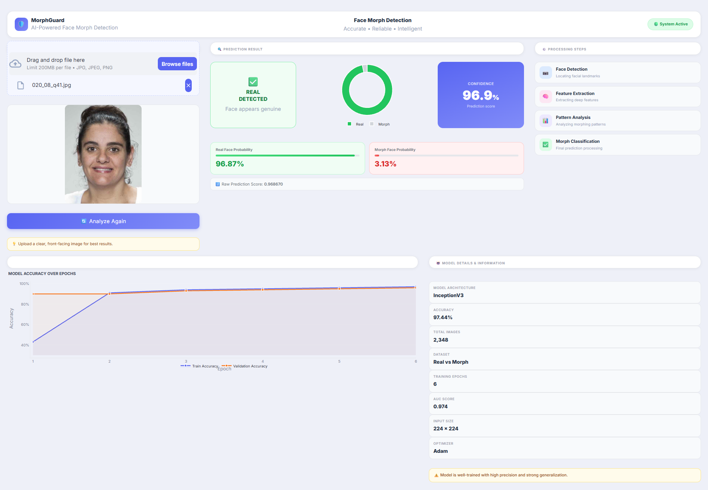

# MorphGuard: AI-Powered Face Morph Detection System

## Live Demo

**Application Link:**
[https://face-morphdetection-fvgwdnkhdh4oltljfin5wk.streamlit.app/]

---

## Project Overview

MorphGuard is a Deep Learning-based Face Morph Detection System developed to identify and classify genuine and morphed facial images.

The system leverages transfer learning with the InceptionV3 architecture and has been trained and evaluated on the AMSL Face Morph Dataset. MorphGuard aims to address security vulnerabilities caused by face morphing attacks in biometric verification systems such as e-passports, national identity systems, and access control applications.

---

## Dashboard Preview



---

## Key Features

* Deep Learning-based Face Morph Detection
* InceptionV3 Transfer Learning Architecture
* Real-Time Image Analysis
* Probability-Based Predictions
* Interactive Streamlit Dashboard
* Professional Visual Analytics
* Lightweight Deployment Architecture

---

## Dataset Information

### AMSL Face Morph Dataset

| Attribute      | Value     |
| -------------- | --------- |
| Genuine Images | 204       |
| Morph Images   | 2175      |
| Total Images   | 2379      |
| Resolution     | 531 × 413 |
| Format         | JPEG      |
| ICAO Compliant | Yes       |

---

## Model Architecture

### Backbone Network

* InceptionV3 (ImageNet Pretrained)

### Fine-Tuning Strategy

* Frozen Base Layers
* Last 50 Layers Fine-Tuned

### Classification Head

```text
GlobalAveragePooling2D
↓
Dense(256, ReLU)
↓
Dropout(0.5)
↓
Dense(1, Sigmoid)
```

### Training Configuration

| Parameter     | Value               |
| ------------- | ------------------- |
| Input Size    | 224 × 224           |
| Batch Size    | 32                  |
| Optimizer     | Adam                |
| Learning Rate | 1e-5                |
| Loss Function | Binary Crossentropy |
| Epochs        | 6                   |

---

## Performance Metrics

| Metric        | Value  |
| ------------- | ------ |
| Test Accuracy | 97.44% |
| ROC-AUC Score | 0.97   |
| Test Loss     | 0.0793 |

---

## System Workflow

```text
Input Face Image
        ↓
Image Preprocessing
        ↓
Feature Extraction (InceptionV3)
        ↓
Deep Feature Analysis
        ↓
Morph Classification
        ↓
Prediction & Confidence Score
```

---

## Project Structure

```text
MorphGuard/
│
├── app.py
├── requirements.txt
├── README.md
│
├── model/
│   └── final_deployment_model.keras
│
├── assets/
│   └── dashboard.png
│
└── screenshots/
```

---

## Installation

### Clone Repository

```bash
git clone <repository-url>
cd MorphGuard
```

### Create Environment

```bash
python -m venv venv
```

### Activate Environment

```bash
venv\Scripts\activate
```

### Install Dependencies

```bash
pip install -r requirements.txt
```

### Run Application

```bash
streamlit run app.py
```

---

## Technologies Used

### Deep Learning

* TensorFlow
* Keras
* InceptionV3

### Data Processing

* NumPy
* Pillow

### Visualization

* Plotly

### Deployment

* Streamlit

---

## Research Contribution

This project investigates the effectiveness of transfer learning techniques for detecting facial morphing attacks and provides a practical deployment framework for real-world biometric security applications.

---

## Future Enhancements

* Multi-Model Ensemble Detection
* Explainable AI Visualizations
* Face Localization Pipeline
* Advanced Morph Attack Analysis
* Cloud-Based Inference API

---

## Authors

Chandra Sekhar

B.Tech Artificial Intelligence & Data Science

---

## License

This project is intended for academic, research, and educational purposes.
